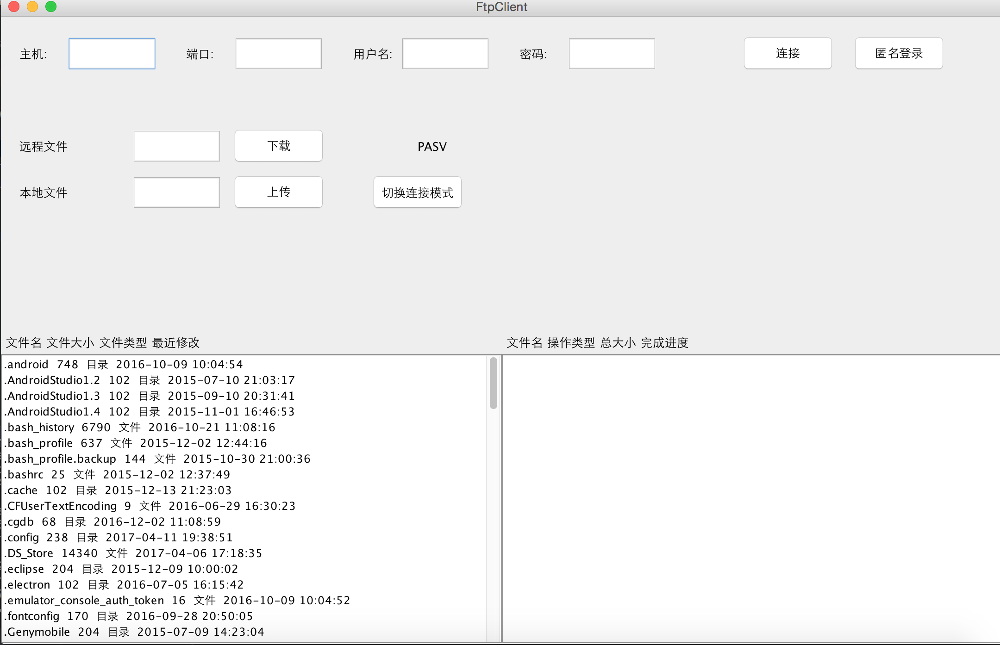

## 华中科技大学计算机网络课程实验。

实验一：Ftp客户端。

*Require：*  
Socket编程，不使用任何现有的库或框架。  
使用Java Socket Api编写Ftp客户端。
>编写一个FTP客户端，要求如下：

>第一级：
能够指定FTP服务器的IP地址和端口号。  
能够支持主动（PORT）和被动（PASV）两种模式连接FTP服务器。  
支持匿名登录和用户名/口令登录二种身份验证。  
能够实现目标FTP服务器上的目录浏览/切换。  
能够在下载/上传前指定下载源目录和上传目标目录。  
实现单线程下载/上传单个文件。  
能够主动断开连接。  
可采用控制台或图形用户界面2种方式。

>第二级：
 能够在一个界面中实现单线程下载/上传单个文件。  
能够在下载/上传前指定下载目标目录和上传源目录。  
具备下载/上传文件队列机制。  
具备完成所需功能的基本图形用户界面（GUI），并具友好性。  

>第三级：
提供下载和上传进度指示及完成指示。  
具备对已下载完的文件进行校验的能力。  
具备连接中断后能自动重新建立连接的能力。  
具备完成所需功能的基本图形用户界面（GUI），并具友好性。  

>第四级：
具备本机目录浏览功能。  
支持上传下载鼠标拖放功能。  
支持断点续传。  
具备完成所需功能的基本图形用户界面（GUI），并具友好性。  

>第五级：
支持多线程同时下载多个文件（多个文件可能来自于同一服务器也可能来自于不同的服务器）。  
每个线程均提供下载和上传进度指示及完成指示。  
具备完成所需功能的基本图形用户界面（GUI），并具友好性。

### How To Use:
两个入口类：

无GUI版本，Shell中运行，入口类Main。

使用Swing编写的简单GUI，入口类FtpGui。

#### Main中目前支持的命令：
1. get 
2. put
3. bye
4. cd
5. pwd
6. port(需要ftp服务器支持)
7. passive
8. pause
9. ls

登陆方式支持匿名登陆和账号登陆。  
匿名登陆账号为Anonymous 密码为任意值。  
由于无法直接获得远程文件的hashcode，文件校验方式是简单的比较远程文件和本地文件的大小。

#### GUI版本

